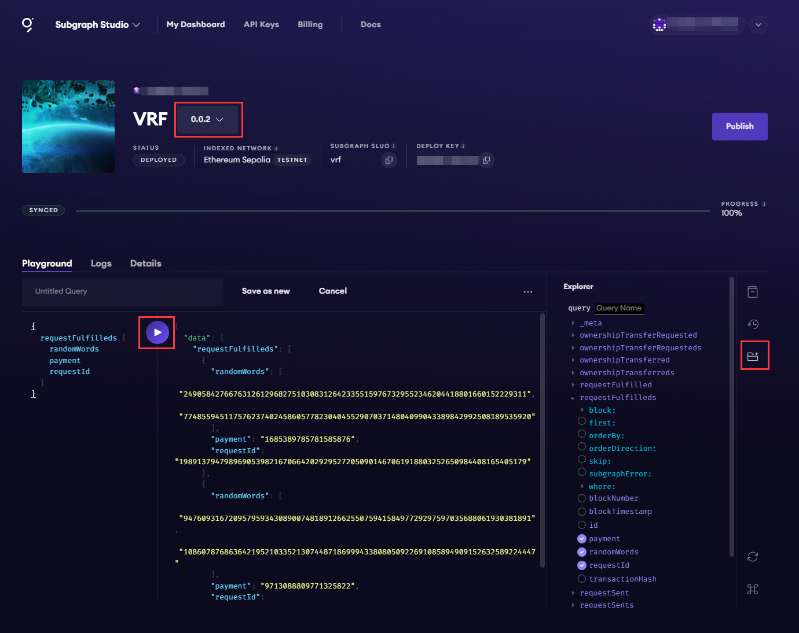

# The Graph交互实践

### 使用方法

#### 一、在子图工作室中创建子图
   
1. 访问[子图工作室](https://thegraph.com/studio/)。

   本次使用子图工作室来部署子图。另外，也可以搭建自己的Graph Node节点来部署子图。

2. 连接钱包。
   
   可直接连接metamask钱包。

3. 创建子图。
   
   本次创建一个VRF子图，用于查询获取随机数事件。

#### 二、安装GRAPH CLI

```shell
> npm install -g @graphprotocol/graph-cli
```

#### 三、初始化子图

参照如下配置，初始化完成后，在vrf目录下subgraph.yaml文件中可以查看配置信息。

```shell
> graph init --studio <SUBGRAPH_SLUG>
> graph init --studio vrf

√ Protocol · ethereum
√ Subgraph slug · vrf
√ Directory to create the subgraph in · vrf
√ Ethereum network · sepolia
√ Contract address · 0x44Cd3824e60B59231110DBEaC4E7509663da42eD
× Failed to fetch ABI from Etherscan:
√ Do you want to retry? (Y/n) · false
× Failed to fetch Start Block: Failed to fetch contract creation transaction hash
√ Do you want to retry? (Y/n) · false
√ ABI file (path) · E:/Code/the-graph-interaction/building/VRFv2DirectFundingConsumerAbi.json
√ Start Block · 5073200
√ Contract Name · VRFv2DirectFundingConsumer
√ Index contract events as entities (Y/n) · true
  Generate subgraph
  Write subgraph to directory
√ Create subgraph scaffold
√ Initialize networks config
√ Initialize subgraph repository
√ Install dependencies with npm install
√ Generate ABI and schema types with npm run codegen
Add another contract? (y/n):
Subgraph vrf created in vrf

Next steps:

  1. Run `graph auth` to authenticate with your deploy key.

  2. Type `cd vrf` to enter the subgraph.

  3. Run `npm run deploy` to deploy the subgraph.

Make sure to visit the documentation on https://thegraph.com/docs/ for further information.
```

字段说明：
```shell
初始化子图时，CLI工具会要求您提供以下信息：

协议：选择子图索引数据的协议
子图段塞：为您的子图创建一个名称。您的子图段塞是子图的标识符。
创建子图的目录：选择您的本地目录
以太坊网络（可选）：您可能需要指定子图将从哪个EVM兼容网络索引数据
合约地址：找到要查询数据的智能合约地址
ABI：如果ABI不是自动填充的，则需要将其手动输入为JSON文件
起始区块：建议您在子图索引区块链数据时输入起始区块以节省时间。您可以通过查找部署合约区块来定位起始区块。
合约名称：输入您的合约名称
将合约事件作为实体进行索引：建议您将其设置为true，因为它将自动为每个发出的事件向子图添加映射
添加其他合约（可选）：您可以添加其他合约
```

### 四、编写子图
前面的命令创建了一个原始子图，可以将其用作构建子图的起点。当对子图进行更改时，将主要使用三个文件:

- 清单（subgraph.yaml）--清单定义子图将索引哪些数据源。
- 模式（schema.graphql）--GraphQL 模式定义从子图中检索到的数据。
- AssemblyScript 映射（mapping.ts）--将数据源中的数据转换为模式中定义的实体的代码。

### 五、部署到子图工作室

生成子图代码：

```shell
> graph codegen

  Skip migration: Bump mapping apiVersion from 0.0.1 to 0.0.2
  Skip migration: Bump mapping apiVersion from 0.0.2 to 0.0.3
  Skip migration: Bump mapping apiVersion from 0.0.3 to 0.0.4
  Skip migration: Bump mapping apiVersion from 0.0.4 to 0.0.5
  Skip migration: Bump mapping apiVersion from 0.0.5 to 0.0.6
  Skip migration: Bump manifest specVersion from 0.0.1 to 0.0.2
  Skip migration: Bump manifest specVersion from 0.0.2 to 0.0.4
√ Apply migrations
√ Load subgraph from subgraph.yaml
  Load contract ABI from abis\VRFv2DirectFundingConsumer.json
√ Load contract ABIs
  Generate types for contract ABI: VRFv2DirectFundingConsumer (abis\VRFv2DirectFundingConsumer.json)
  Write types to generated\VRFv2DirectFundingConsumer\VRFv2DirectFundingConsumer.ts
√ Generate types for contract ABIs
√ Generate types for data source templates
√ Load data source template ABIs
√ Generate types for data source template ABIs
√ Load GraphQL schema from schema.graphql
  Write types to generated\schema.ts
√ Generate types for GraphQL schema

Types generated successfully
```

构建子图：

```shell
> graph build

  Skip migration: Bump mapping apiVersion from 0.0.1 to 0.0.2
  Skip migration: Bump mapping apiVersion from 0.0.2 to 0.0.3
  Skip migration: Bump mapping apiVersion from 0.0.3 to 0.0.4
  Skip migration: Bump mapping apiVersion from 0.0.4 to 0.0.5
  Skip migration: Bump mapping apiVersion from 0.0.5 to 0.0.6
  Skip migration: Bump manifest specVersion from 0.0.1 to 0.0.2
  Skip migration: Bump manifest specVersion from 0.0.2 to 0.0.4
√ Apply migrations
√ Load subgraph from subgraph.yaml
  Compile data source: VRFv2DirectFundingConsumer => build\VRFv2DirectFundingConsumer\VRFv2DirectFundingConsumer.wasm
√ Compile subgraph
  Copy schema file build\schema.graphql
  Write subgraph file build\VRFv2DirectFundingConsumer\abis\VRFv2DirectFundingConsumer.json
  Write subgraph manifest build\subgraph.yaml
√ Write compiled subgraph to build\

Build completed: build\subgraph.yaml
```

授权子图，DEPLOY_KEY在子图工作室网页查看。

```shell
> graph auth --studio <DEPLOY_KEY>
> graph auth --studio 4fb552********************9067d3

 »   Warning: In next major version, this flag will be removed. By default we will deploy to the Graph Studio. Learn
 »   more about Sunrise of Decentralized Data https://thegraph.com/blog/unveiling-updated-sunrise-decentralized-data/
 Deploy key set for https://api.studio.thegraph.com/deploy/
```

部署子图，需要输入部署版本号，比如：0.0.1。

```shell
> graph deploy --studio <SUBGRAPH_SLUG>
> graph deploy --studio vrf

  Skip migration: Bump mapping apiVersion from 0.0.1 to 0.0.2rf
  Skip migration: Bump mapping apiVersion from 0.0.2 to 0.0.3
  Skip migration: Bump mapping apiVersion from 0.0.3 to 0.0.4
  Skip migration: Bump mapping apiVersion from 0.0.4 to 0.0.5
  Skip migration: Bump mapping apiVersion from 0.0.5 to 0.0.6
  Skip migration: Bump manifest specVersion from 0.0.1 to 0.0.2
  Skip migration: Bump manifest specVersion from 0.0.2 to 0.0.4
√ Apply migrations
√ Load subgraph from subgraph.yaml
  Compile data source: VRFv2DirectFundingConsumer => build\VRFv2DirectFundingConsumer\VRFv2DirectFundingConsumer.wasm
√ Compile subgraph
  Copy schema file build\schema.graphql
  Write subgraph file build\VRFv2DirectFundingConsumer\abis\VRFv2DirectFundingConsumer.json
  Write subgraph manifest build\subgraph.yaml
√ Write compiled subgraph to build\
  Add file to IPFS build\schema.graphql
                .. QmSQdseshLoNp9mUBXC8ZEeSFizNUnnu1ea3v9iaWzg7gN
  Add file to IPFS build\VRFv2DirectFundingConsumer\abis\VRFv2DirectFundingConsumer.json
                .. QmbJJDDPip582p1Qk4Fh6RCT4Yekcm4yW1nRCGXTFddkKt
  Add file to IPFS build\VRFv2DirectFundingConsumer\VRFv2DirectFundingConsumer.wasm
                .. QmcwnpqoMKjPBKoz1BeFBtci3WCnP615E2NaYheeYd18Sg
√ Upload subgraph to IPFS

Build completed: QmQppWLTPnt7ApAFNiHhN2oCxoPxHATq7sa16CLyHGKCDu

× HTTP error deploying the subgraph ECONNRESET
UNCAUGHT EXCEPTION: Error: EEXIT: 1

```

最后的报错好像不影响，到网页查看子图已经部署上去了。

部署完成后，打开子图工作室网页，选择对应的版本。等待扫块进度完成PROGRESS 100%。

右边勾选要查看的事件和字段，点击中间播放按钮，即可显示事件和字段数据。

图中可以看到，已经获取到了requestFulfilled事件和随机数。




### 参考文档

[The Graph 官方文档](https://thegraph.com/docs/zh/quick-start/)

[graph-cli 插件指导](https://www.npmjs.com/package/@graphprotocol/graph-cli)